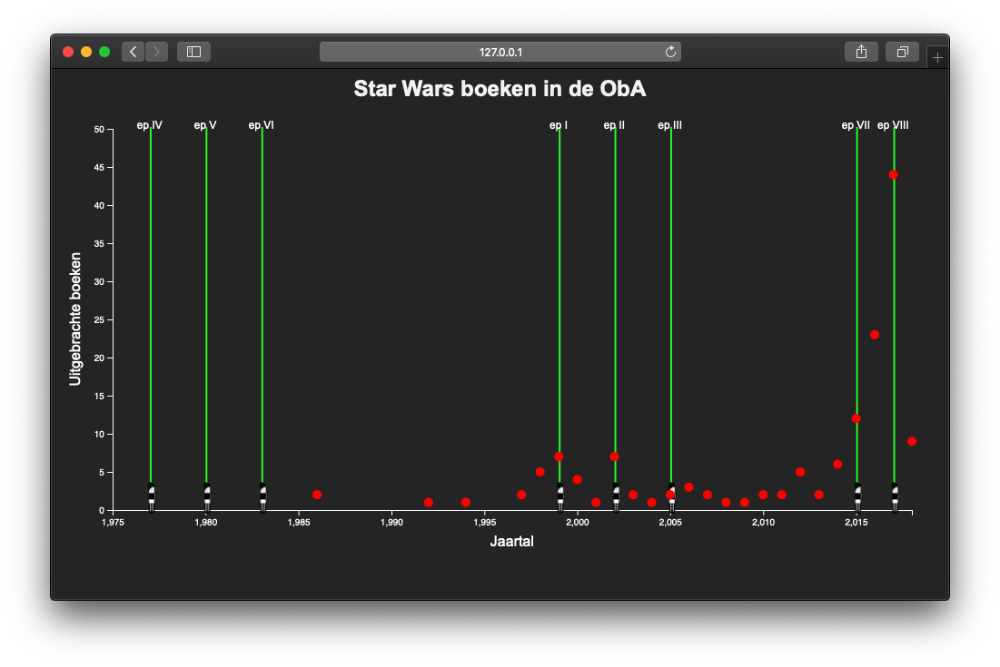
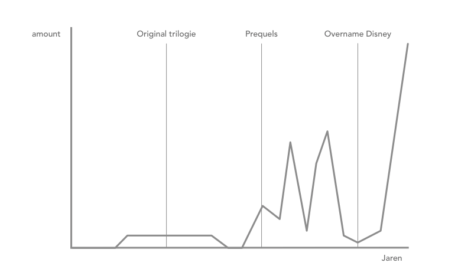

# Functional-Programming


## Index

**[Installation](#How-to-install)**<br>
**[Research Questions](#Research-questions)**<br>
**[Code](#code-used)**<br>
**[Plan of Action](#plan-of-action)**<br>
**[Conclusion](#conclusion)**<br>
**[Credits](#credits)**<br>


### How to install

Request a key from OBA

```
Clone the repo:
git clone https://github.com/sjerrietukkel/functional-programming

Install OBA-scraper:
npm i @gijslaarman/oba-scraper

Create .env file for storing API key:
touch .env

paste the APIkey in the .env file:
PUBLIC_KEY=your_API_key

Start up the nodeJS server:
node index
```

#### Packages used
* Axios
* Chalk
* Dotenv
* Express
* Jsonpath
* Oba-api
* Query-string
* Xml-to-json-promise
* Xml2js
* Oba-Scraper

### Research Questions

1. Is the length of book with cats as subject longer for children's books, nature books or fairytales?
2. What are the most populair animals children's literature?
3. What animal is populair in what era?
4. Is there a difference in the animals used in books for different ages?
5. How many times is the name of the animal used in the title?
6. Length of the titles in different times.
7. **How big is the difference in Star Wars books published after Disney bought LucasArts (in 2012)**


### Hypotheses
I think Disney used books as marketing material in stead of using it to improve on the Star Wars universe, therefore there must be more books published leading up to the sequel movies (Episode VII & VII). 

#### Parameters needed

* Publication Year (pubYear)
* format (Books)
* Release dates of Star Wars movies

### Code used

#### Oba API
Understanding the API was difficult especially since the documentation was outdated and was very vague. Daniel van de Velde helped me alot with the documentation he wrote. Gijs Laarman created an excellent scraper which I used for the resit. My original code is explained below. 


#### Used code to receive books.
```js
client.getAll('search',
      {
      q: 'star wars',
      facet: 'type(book)',
      refine: true
      },
      {
        page: 1,
        pagesize: 20,
        maxpages: 5
      })
```      
Compressing the data and creating a .json file
```js

.then(response => {
  const data = response.data
  // response ends up here
  console.log(response)
  // lege array waar de opgehaalde data in gepush'd
  let dataArray = [];
// Laat van de arrays de geselecteerde objecten zien 
  
  const results = data.map(book => {
    return {
      title: book.titles[0].title[0]['_'],
      coverImage: book.coverimages[0].coverimage[0]['_'],
      summary: book.summaries[0].summary[0]
    }
  })

  let total = {
    url: response.url, 
    data: results
  };

  // pushed in de array
  dataArray.push(total);
  return dataArray
  
})
```

#### Data nesting 

```js
  var bookNested = d3
          .nest()
          .key(data => data.pubYear)
          .rollup(function(data) {
              return data.length
          })
          .entries(data) 
```
This returned the data as an array with the following objects for each year something was published
```js
{key: "2010", value: 2}
```
 
### Sketching
    
This what I expected the outcome would look like

### Conclusion 
Understanding the API was a challenge, it had a lot of restrictions and a lot of the data it returned was dirty as hell.I am however proud of my end result. The first time I lost a lot of time coming up with a solid concept (which I threw away for the resit) and expierenced a lot of difficulities regarding the data. This time around it went a lot smoother thanks to the Gissa scraper and a more executable concept. 
I got the hang of D3, and while it isn't always clear what you have to do or how (looking at you Observable) I did enjoy it alot and want to continue learning it. 

### Plan of Action

##### ✅ Done

- [x] Connect with the API
- [x] Search throught the data and select interesting variables
- [x] Define research questions.
- [x] Create sub-questions
- [x] Think about visualisation
- [x] Create datastorage with relevant data
- [x] Visualize with D3


##### ❌ To-do 
- [ ] Add neon lights to lightsaber
- [ ] Add tooltip to give to user more information.
- [ ] Multiple promises
- [ ] Fix issue on X-axis 
- [ ] Correct lightsaber (Luke, not Darth Vader)

#### Credits
* [@Daniel van de Velde](https://github.com/DanielvandeVelde/functional-programming/blob/master/README.md) Aquabrowser Documentation <br>
* [@Gijslaarman](https://github.com/gijslaarman/) Gissa Scraper <br>
* [@TechDemo]Marcel Fleuren 