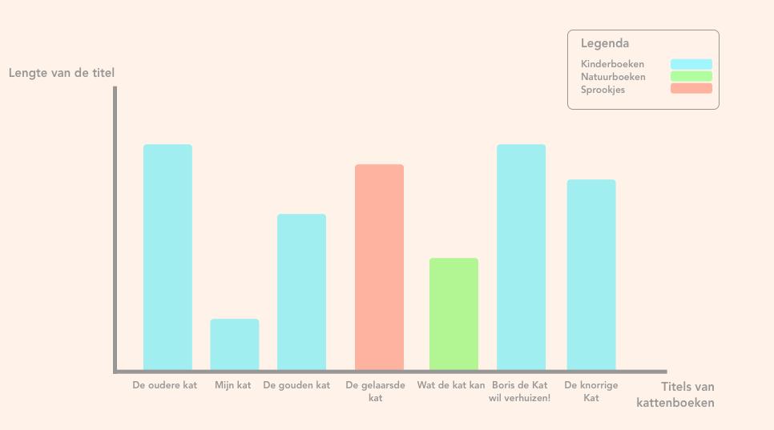

# Functional-Programming

## Index

**[Installation](#How-to-install)**<br>

**[Plan of Action](#plan-of-action)**<br>


### How to install

Request a key from OBA

```
Clone the repo:
git clone https://github.com/sjerrietukkel/functional-programming

Install packages:
npm install

Create .env file for storing API key:
touch .env

paste the APIkey in the .env file:
PUBLIC_KEY=your_API_key

Start up the nodeJS server:
node index
```

#### Packages used
* Axios
* Chalk
* Dotenv
* Express
* Jsonpath
* Oba-api
* Query-string
* Xml-to-json-promise
* Xml2js

#### Oba API
Understanding the API was difficult especially since the documentation was outdated and was very vague Daniel van de Velde helped me alot with the documentation he wrote. 

### Research Questions

1. Is the length of book with cats as subject longer for children's books, nature books or fairytales?
2. What are the most populair animals children's literature?
3. What animal is populair in what era?
4. Is there a difference in the animals used in books for different ages?
5. How many times is the name of the animal used in the title?
6. Length of the titles in different times.


### Hypotheses
I think the titlelength with 'cats' will be longer for children's book, because they tend to give an impression of the book with a combination of the title and coverimage that has to speak to the imagination of a child.

#### Parameters needed

* genre
* format 
* title

### Code used
Used code to receive books.
```ruby
client.getAll('search',
      {
       q: 'title:kat',
       librarian: true,
       refine: true,
       facet:'type(book)&facet=genre(sprookjes)'
      },
      {
        page: 1,
        pagesize: 20,
        maxpages: 5
      })
```      
Compressing the data and creating a .json file
```ruby

.then(response => {
  const data = response.data
  // response ends up here
  console.log(response)
  // lege array waar de opgehaalde data in gepush'd
  let dataArray = [];
// Laat van de arrays de geselecteerde objecten zien 
  
  const results = data.map(book => {
    return {
      title: book.titles[0].title[0]['_'],
      coverImage: book.coverimages[0].coverimage[0]['_'],
      summary: book.summaries[0].summary[0]
    }
  })

  let total = {
    url: response.url, 
    data: results
  };

  // pushed in de array
  dataArray.push(total);
  return dataArray
  
})
```
 
### Sketching


### Plan of Action

##### ✅ Done

- [x] Connect with the API
- [x] Search throught the data and select interesting variables
- [x] Define research questions.
- [x] Create sub-questions
- [x] Think about visualisation
- [x] Create datastorage with relevant data


##### ❌ To-do 
- [ ] Visualize with D3

#### Credits
* Dennis Wegereef
* Daniel van de Velde
* Gijs Laarman
